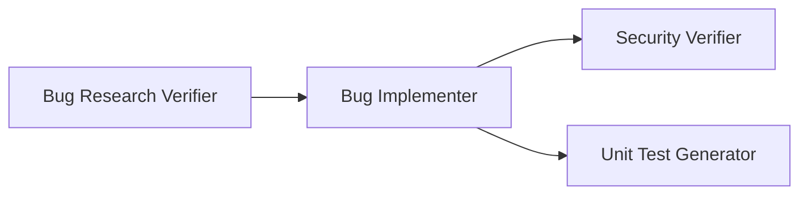

# Homework 4 — 4-Agent Pipeline

This homework implements a **4-agent pipeline** for bug fixing:

## Project Layout
- Demo app (buggy → fixed): `homework-4/demo-bug-fix/`
- Agents: `.github/agents/*.agent.md`
- Skills: `.github/skills/<skill-name>/SKILL.md`
- Bug artifacts (research/plan/fix/security/tests): `homework-4/context/bugs/API-404/`
- Screenshots: `homework-4/docs/screenshots/`

## Bug
Bug ID: **API-404**
- Symptom: `GET /api/users/123` returns 404 even though user 123 exists
- Root cause: `req.params.id` is a string but stored IDs are numbers, causing strict equality mismatches

## How to run
See `HOWTORUN.md`.

## Artifacts
- Research: `context/bugs/API-404/research/codebase-research.md`
- Verified research: `context/bugs/API-404/research/verified-research.md`
- Implementation plan: `context/bugs/API-404/implementation-plan.md`
- Fix summary: `context/bugs/API-404/fix-summary.md`
- Security report: `context/bugs/API-404/security-report.md`
- Test report: `context/bugs/API-404/test-report.md`
